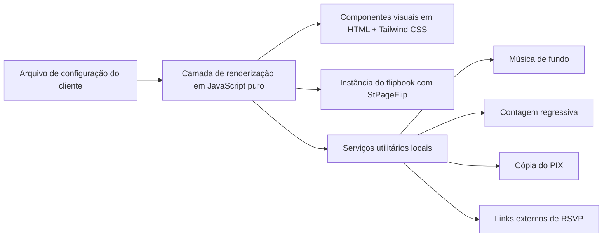

## 1. Desenho de Arquitetura


## 2. Descrição de Tecnologia
- Frontend: HTML5 + Tailwind CSS CDN + JavaScript Vanilla
- Biblioteca principal: `StPageFlip` para efeito de flipbook
- Estrutura de dados: arquivo `config.js` exportando objeto único `weddingConfig`
- Hospedagem alvo: site estático em qualquer CDN ou storage estático
- Inicialização: carregamento sequencial de `config.js` e `script.js` no `index.html`

## 3. Definição de Rotas
| Rota | Propósito |
|------|-----------|
| `/` | Página única do convite com abertura, flipbook, ações rápidas e informações do evento |

## 4. Estrutura de Arquivos Proposta
| Caminho | Finalidade |
|---------|------------|
| `index.html` | Casca principal da página, pontos de montagem e importações externas |
| `assets/css/` | Estilos complementares opcionais para refinamentos fora do Tailwind utilitário |
| `assets/js/config.js` | Fonte única dos dados variáveis de cada casal |
| `assets/js/script.js` | Renderização dinâmica, inicialização do flipbook e utilitários da interface |
| `assets/media/audio/` | Faixas locais opcionais de música do casal |
| `assets/media/pages/` | Imagens exportadas do Canva para páginas completas do flipbook |
| `assets/media/couple/` | Fotos de capa, thumbnails e imagens auxiliares |

## 5. Modelo de Dados
### 5.1 Estrutura do Objeto de Configuração
```js
const weddingConfig = {
  meta: {
    templateName: "convite-flipbook-base",
    locale: "pt-BR",
    theme: "classic-romantic"
  },
  couple: {
    brideName: "",
    groomName: "",
    displayName: "",
    storyHeadline: ""
  },
  event: {
    dateISO: "",
    ceremonyLabel: "",
    venueName: "",
    venueAddress: "",
    mapsUrl: ""
  },
  audio: {
    src: "",
    autoplay: false,
    loop: true
  },
  actions: {
    rsvpUrl: "",
    pixKey: "",
    pixCopyPaste: ""
  },
  pages: [
    {
      id: "cover",
      type: "image",
      image: "",
      alt: ""
    },
    {
      id: "details",
      type: "content",
      title: "",
      body: [],
      accent: ""
    },
    {
      id: "hybrid",
      type: "split",
      image: "",
      title: "",
      body: []
    }
  ]
};
```

### 5.2 Regras do Modelo
- `pages[].type = "image"`: usa uma arte inteira criada externamente, ocupando a página toda.
- `pages[].type = "content"`: gera layout textual com blocos montados via JS.
- `pages[].type = "split"`: combina imagem e conteúdo textual na mesma página.
- Campos desconhecidos devem ser ignorados pelo renderizador para manter extensibilidade simples.
- Campos opcionais vazios não devem quebrar a renderização; apenas ocultam o bloco correspondente.

## 6. Componentes de Frontend
| Componente lógico | Responsabilidade |
|-------------------|------------------|
| `renderHero()` | Preenche identidade principal do casal e dados imediatos do evento |
| `renderPages()` | Transforma a configuração em nós HTML compatíveis com o flipbook |
| `createImagePage()` | Gera páginas baseadas em arte completa |
| `createContentPage()` | Gera páginas textuais com títulos, parágrafos e destaques |
| `createSplitPage()` | Gera páginas híbridas com imagem e conteúdo |
| `initFlipbook()` | Inicializa `StPageFlip` com opções de tamanho, sombra e interação |
| `initCountdown()` | Atualiza cronômetro com base em `event.dateISO` |
| `initAudio()` | Gerencia estado de reprodução e UI de play/pause |
| `initPixCopy()` | Copia o código PIX configurado para a área de transferência |

## 7. Decisões Técnicas
- Usar JavaScript puro em vez de framework porque o requisito principal é leveza, replicação rápida e independência para white-label.
- Centralizar todos os dados mutáveis em `config.js` para reduzir risco operacional na troca de clientes.
- Tratar o flipbook como motor visual desacoplado do conteúdo; a camada de renderização entrega HTML pronto para ele.
- Separar páginas por tipo para permitir pipeline híbrido entre design no Canva e conteúdo preenchido dinamicamente.
- Manter a solução sem backend por padrão; integrações externas entram apenas como links configuráveis.

## 8. Estratégia de Responsividade
- Desktop-first com largura de livro prioritária para telas grandes.
- Em mobile, reduzir proporção do flipbook, simplificar sombras e reorganizar botões para a parte inferior.
- Garantir que imagens de página usem `object-fit: cover` ou `contain` conforme o tipo de arte definida.
- Ajustar conteúdo textual com limites de largura e escalonamento de tipografia para evitar overflow.

## 9. Estratégia de Evolução
- Novos clientes exigem apenas duplicar o projeto e alterar `assets/js/config.js` e os arquivos de mídia.
- Futuras extensões, como lista de presentes ou confirmação integrada por WhatsApp, entram como novos blocos configuráveis sem reescrever a base.
- Se a operação SaaS crescer, o objeto de configuração pode migrar de arquivo local para JSON remoto sem alterar a arquitetura visual.
