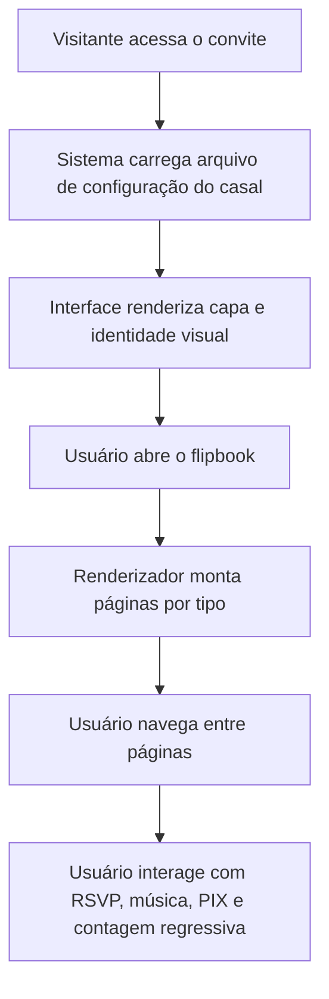

## 1. Visão Geral do Produto
Template base de site para convite de casamento com experiência de flipbook, pensado para operação white-label e replicação rápida entre múltiplos clientes.
- Resolve a necessidade de trocar dados do casal, mídia e links sem reescrever a interface principal.
- Entrega valor como base SaaS leve, modular e fácil de adaptar para convites premium com design em imagem, conteúdo dinâmico ou formato híbrido.

## 2. Funcionalidades Centrais

### 2.1 Módulos Funcionais
1. **Página inicial do convite**: tela de abertura, moldura visual, carregamento do flipbook e controles globais.
2. **Experiência de flipbook**: navegação por páginas com suporte a imagens completas, blocos dinâmicos e páginas mistas.
3. **Blocos informativos do evento**: data, local, cronograma opcional e contagem regressiva.
4. **Ações do convidado**: RSVP, botão de reprodução de música e botão de PIX copia e cola.
5. **Camada de configuração**: arquivo isolado com dados mutáveis do casal, textos, URLs, mídia e ordem das páginas.

### 2.2 Detalhamento das Páginas
| Nome da página | Nome do módulo | Descrição da funcionalidade |
|----------------|----------------|-----------------------------|
| Página inicial | Tela de abertura | Exibe identidade visual do casal, mensagem principal e CTA para abrir o convite |
| Página inicial | Container do flipbook | Renderiza o livro com `StPageFlip`, controla tamanho, responsividade e eventos de navegação |
| Página inicial | Renderizador de páginas | Monta páginas dinamicamente a partir da configuração, aceitando tipo `image`, `content` e `split` |
| Página inicial | Controles auxiliares | Disponibiliza play/pause da música, atalho de RSVP, botão PIX e navegação entre páginas |
| Página inicial | Rodapé informativo | Exibe contagem regressiva, mensagens finais e links úteis |

## 3. Fluxo Principal
O visitante acessa o link do convite, vê a apresentação do casal e abre o flipbook. O sistema carrega os dados do cliente a partir de um arquivo de configuração único, inicializa o livro, renderiza cada página conforme seu tipo e mantém ativos os recursos auxiliares como música, RSVP, PIX e contagem regressiva.

## 4. Design da Interface
### 4.1 Estilo Visual
- Cores principais: paleta sofisticada com fundo claro quente, tons champagne, verde profundo e dourado suave como acento.
- Estilo dos botões: bordas arredondadas, acabamento elegante e microinterações discretas.
- Tipografia: fonte serifada marcante para títulos e fonte legível refinada para textos de apoio.
- Layout: desktop-first com composição editorial centralizada, livro em destaque e controles periféricos leves.
- Ícones: linha fina, aparência delicada e coerente com casamento premium.

### 4.2 Visão Geral da Página
| Nome da página | Nome do módulo | Elementos de UI |
|----------------|----------------|-----------------|
| Página inicial | Hero de abertura | Nome do casal, data do evento, subtítulo, botão de abrir convite |
| Página inicial | Flipbook | Moldura central, sombra suave, páginas com suporte a imagem cheia ou conteúdo estruturado |
| Página inicial | Painel lateral/inferior | Botões de áudio, RSVP e PIX com estados visuais compactos |
| Página inicial | Barra de status | Contagem regressiva em destaque com atualização em tempo real |
| Página inicial | Plano de fundo | Textura sutil, gradiente leve e atmosfera romântica sem poluição visual |

### 4.3 Responsividade
- Estratégia desktop-first com adaptação para tablets e mobile.
- Em telas menores, o flipbook pode reduzir dimensões e reorganizar os controles em barra fixa inferior.
- Interações devem ser compatíveis com toque, incluindo swipe e botões com área de toque confortável.
- O conteúdo dinâmico precisa respeitar limites visuais para não quebrar páginas em layouts compactos.

## 5. Requisitos Funcionais
- Todo dado mutável do cliente deve ficar fora do `index.html` principal, em arquivo dedicado de configuração.
- O sistema deve suportar páginas compostas apenas por imagens externas ou locais.
- O sistema deve suportar páginas dinâmicas montadas com títulos, textos, listas, destaque de data e blocos informativos.
- O sistema deve permitir combinar páginas de imagem e páginas de conteúdo no mesmo convite.
- A música de fundo deve ser carregada dinamicamente e controlada por botão play/pause.
- O RSVP deve aceitar pelo menos um link externo configurável.
- O PIX deve permitir botão de copiar código cola-e-copia a partir da configuração do cliente.
- A contagem regressiva deve ser calculada a partir da data do evento definida em configuração.

## 6. Requisitos Não Funcionais
- Base leve e sem frameworks pesados, usando HTML5, Tailwind CSS, `StPageFlip` e JavaScript puro.
- Estrutura de arquivos clara para facilitar manutenção e replicação por operação comercial.
- Código orientado a módulos simples, com funções pequenas e responsabilidade definida.
- Dependência mínima de backend, priorizando publicação estática.
- Facilidade para troca rápida de cliente sem alteração estrutural no código principal.
